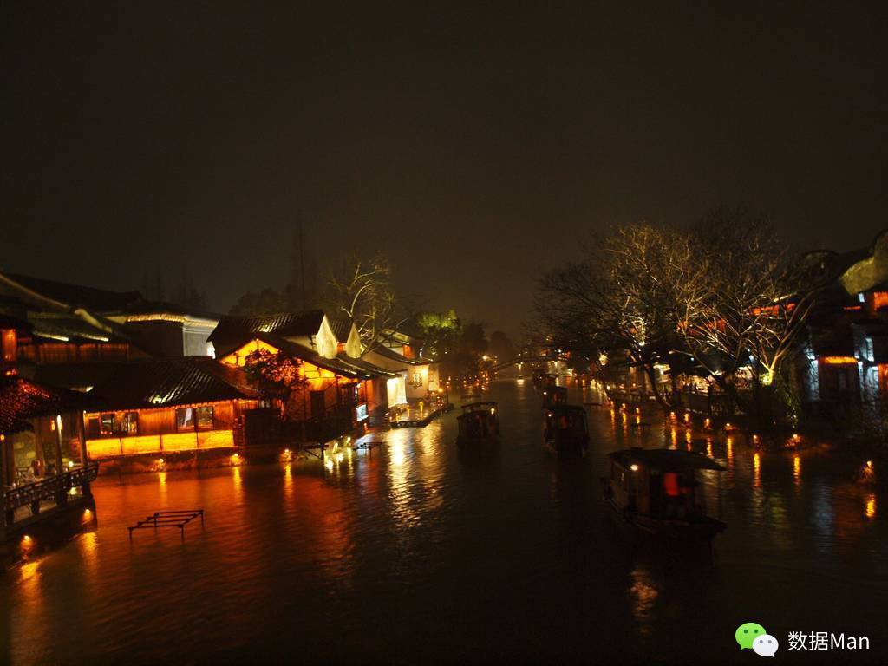
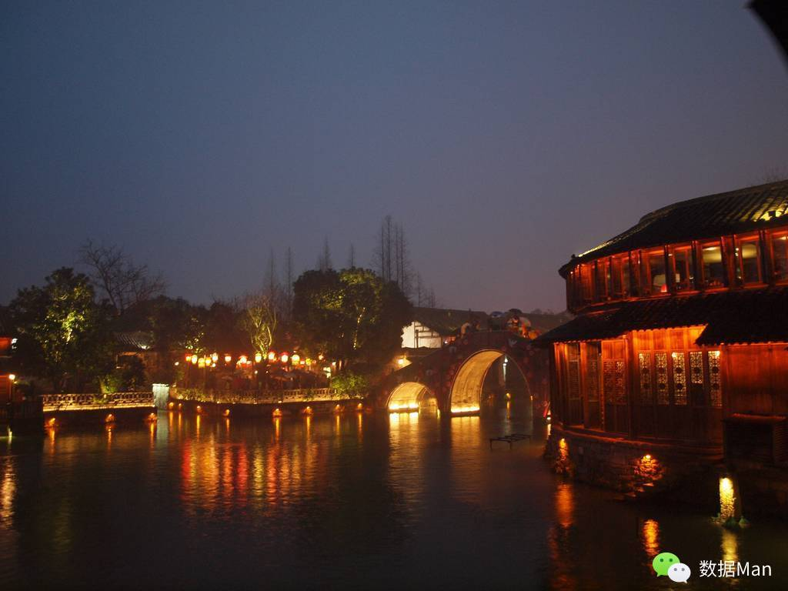

# 美丽的江南小镇

> 以前对这种夜晚灯光营造的璀璨老是不屑一顾，在于自恃看破了其中掩盖白日里肮脏与不堪的事实。而真当夜幕降临，这儿的灯光并不十足，眼前所见联想到的是古镇居民平淡而自足的世外生活场景，反而让我忘记了那份自傲，不知不觉沉醉于其中，竟叫人不好意思开口说道了......

其实最初的计划当中是不包含乌镇的，之所以后来考虑加入是因为这样便可以和上海的老同学伴我一起走上我环国旅行的第一站。这样的想法既带给我与老友相聚随行的温暖与兴奋，又有一种虚构的点火仪式般的庄重感诞生于心中，给这漫长孤单的一个人的旅行添加一份出发的意义。同时，我甚至想到乌镇行结束之际，他们将目送我离去，我将踏上只属于我一个人的征途。那样的境界让我想到送行荆轲的场面，虽无那般的壮烈，但是心中却有类似的波澜。

到达乌镇，排着长队，轮到我们后，坐上载有十五人左右的小船，经过一段水域，像是一段现实世界到偏隅边城的过渡。在这过程中，逐渐忘却终日忙碌的社会中的那份焦虑与不安，而在到达彼岸古镇的那一刻，你渐已融入此地，而忘却了那个大都市的你的生活状态。这感觉就像是在炎热烦闷的夏天你总是难以想象到冬季冰冷的空气带给你皮肤刻骨般的刺激。

上岸之后，眼光所到之处才是真正意义上的乌镇，也是那个在外围被现代化设施小心包裹住的乌镇。即便如此，当你真正静下心来沿着那悠长、悠长又寂寥的雨巷走着，除了没有逢着一个丁香般结着愁怨的姑娘，也不会固执于自己其实处于一个楚门的世界。因为这并不算是自我欺骗，而是环境带给你心境的变化，那是你真实内心的反映。旅行应该就是这般的无关乎真与假、是与非，而在于自我境界的反射，因为本来这个世界在你眼中的样子就是由你自己决定，而与他人无关。这一点和爱情有异曲同工之妙，就像有人在深爱一个人且经历一番挣扎后依旧保持那份爱时喊出了那句——“我爱你，与你无关”。旅行中的事物虽说难以像那份爱来得惊心动魄，但也必然有那些个触发过你那平静的内心，或感怀或激动。

说是雨巷，我们真就在半途遇到了江南小镇常有的春雨。雨水溜到镜片上，视线开始模糊，小镇在你面前退缩了几步，好像一个怕见生人的姑娘低头掩面，你往前，她便退后，始终与你保持着一定距离。索性自退一步，远看这小镇，在这绵绵不绝的雨水的冲刷下，更是增添了一份历史的沧桑感，因而陈丹青老师才提到前些年来乌镇的时候没觉得什么，过了些年再来的时候，房子、道路什么的都有些旧了、斑驳了，倒有点味道了。

住进青旅，待雨势小了一些，我们便开始细看刚刚匆匆走过的地方，不少的店铺挤满了游客，才发现这儿的商业味还是挺重的。可如果不是这般的各类服务设施的到位，那么由此可想到的不便的交通和落后的服务业给在大城市被惯坏的我们来说，还不知是一份享受还是难受呢？只不过略不舒服的是，少了一份刚刚走过时的好奇与激动。这时突然看到前面桥头下冒出的乌篷船，里面的人们不用顾忌外面的雨水会打湿衣服，而处于那样的半封闭的小世界中看待两岸的形形色色，想必会有过眼云烟般地略过世间百态的感觉吧。

晚上我们在一间安静的小酒吧，每人点上一瓶说不来的洋酒，并非要提升那虚妄的逼格，而是在这古朴小镇中找寻到平常熟悉的事物，和老友静下心来闲聊一番。放松下平日里繁忙的身躯，以及为从大都市到江南小镇的快速切换中找到一个折衷地带，少些不适，多点缓慢的气氛也便足矣。

第二天醒来，整个小镇很是安静，仿佛还在沉睡，我们也似乎不愿打扰她，小声地交谈着，悄悄地离开这里。
