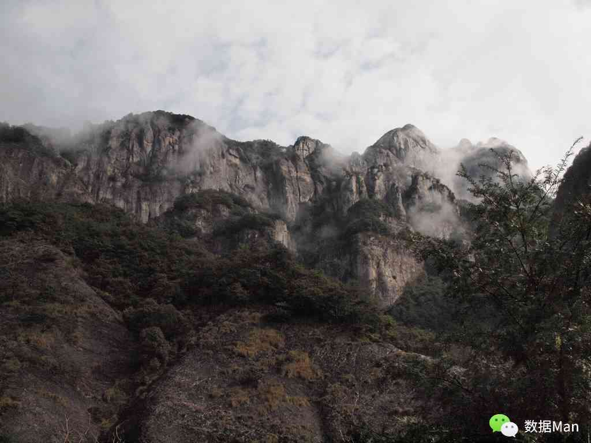

# 雁荡之旅

> 初到之时，烟雨之间，乍见如此的气势，不免引起一番震撼，可是后来的事，谁又能知道呢?

第一次知道雁荡山，是看到同学的一张照片，身旁有一块刻有“断肠崖”的大石，才知道原来是拍摄过《神雕侠侣》的卧龙谷景区，本着对金庸武侠剧的喜爱，便想去看看。

此次旅行之前，我在网上了解了下，这个景点已经关闭了，原因是多起游客救援事件（甚至有为情所困而来自杀的）导致。不过还是决定去看看，原因有三：一在于雁荡山是所谓的“三山五岳”之一，想着有机会的话全部能去到还是挺不错的；二在于从乌镇去福州的火车，也是正好经过雁荡山，所以不会走弯路；三在于那儿没有任何熟人，这是第一次自我锻炼的机会，想体验一番。

进山之后，渐渐发现人很少，很多地方已经失修，于是干脆立了牌子“禁止前行”，可有趣的是连这牌子竟也模糊不清了，看来这儿作一景区越来越不合格了。不过如此一来，倒似乎有点回归了大山原本的一点野性，而失去了那种良好的设施带给人的温柔，像是回到了家乡那片由于越来越少人砍柴而至渐渐茂密的山林之中。往前走一会儿工夫，只见一湍白流急下，在空中划出一道口子，走得近了些，便听到撞击湖面的噼里啪啦声，原来是到了大龙湫。凑到跟前，感觉有些凉意，想来是适合夏季避暑的。

除却这儿又游了灵岩，其间甚至尝试了越过那些提示牌，却也未寻着上山顶之道。返回途中，遇到飞渡山峰的表演，便停下观看，有趣的是我驻足的地方有广播放着早已录制好的解说，这个节奏正好和表演者一致，让我产生了错觉，这是配合还是指引，不过由此可见他们已经在此重复无数遍了。

此处罢了，雁荡山之行便也草草结束，无多兴奋，倒有一个人独处的那份轻松和自由。