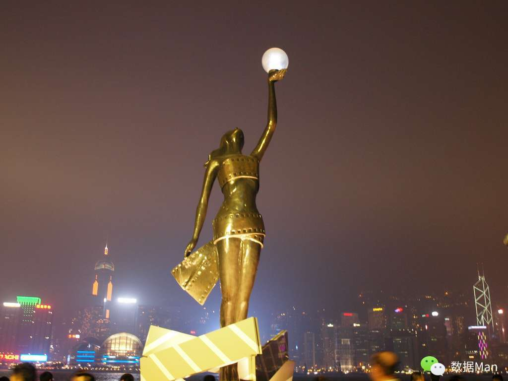

# 香港

香港之行，甚是匆匆，作为一个过客如此急促的行程倒是与这城市中打拼的人们保持了同样的节奏。

从深圳过关后即坐地铁穿过漫长的农村地带方到那个想象中的繁华都市。走在宽阔的地段之时，如果不是一些繁体字的标识甚至不容易觉察到这是在香港。而当走进一些狭窄的街道，街边的八卦杂志亭以及临时搭建的帐篷之类看上去有些杂乱的事物侵入眼前，而同时此处可能不时地经过几辆公交，这种揉和了现代便捷交通和稍显古旧的店铺设施的感觉，让人意识到这个弹丸之地的现代化已到了渐行渐缓甚至停滞的地步。这让我联想到近些年来的赴港大陆游客屡见不鲜的被宰事件，这种涸泽而渔的行为同因电商兴起而导致日益没落的中关村近几年来的大量欺客事件如出一辙，这是一个地区逐渐衰败的迹象, 无疑是给日渐萧条的香港经济雪上加霜的打击。

晚上，走在星光大道上，李小龙和梅艳芳的雕像仍然引得不少游客拍照留念，看着地上那些个明星的手印，随之浮现的是电影中以及过去媒体口中的那颗璀璨的东方之珠，更是让人感怀世事的沧桑。可如今的景象是香港的不少导演和艺人都选择了北上与大陆合作的路线。以至于当《扫毒》这样典型的港式警匪片重归观众眼线的时候，人们更多的是感叹香港电影日薄西山之时奋力投掷的那一刻辉煌，多少让一直看着港片成长的人们感动不已。

在第二天乘船离开之际，看到这个可爱的地方渐渐消逝在眼前，竟流露出一点悲天悯人式的感怀。