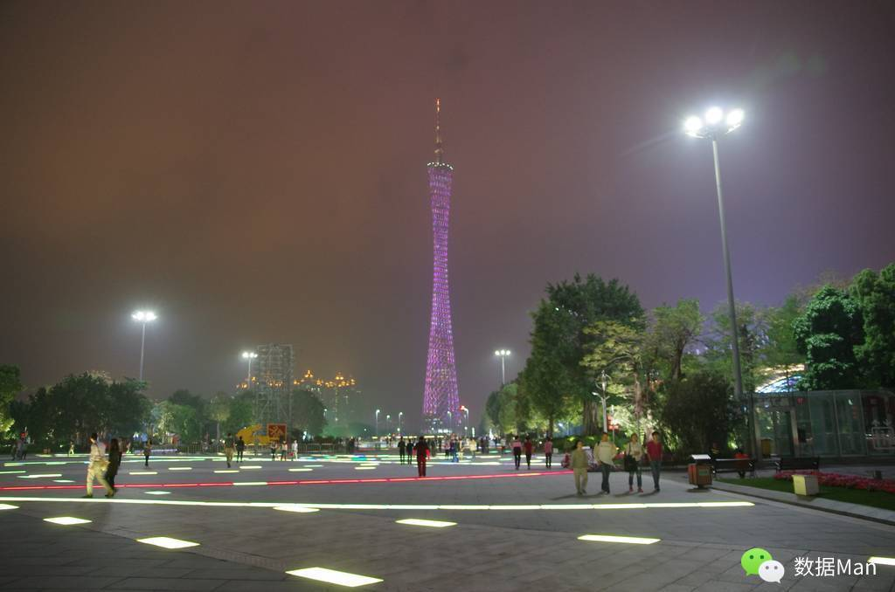
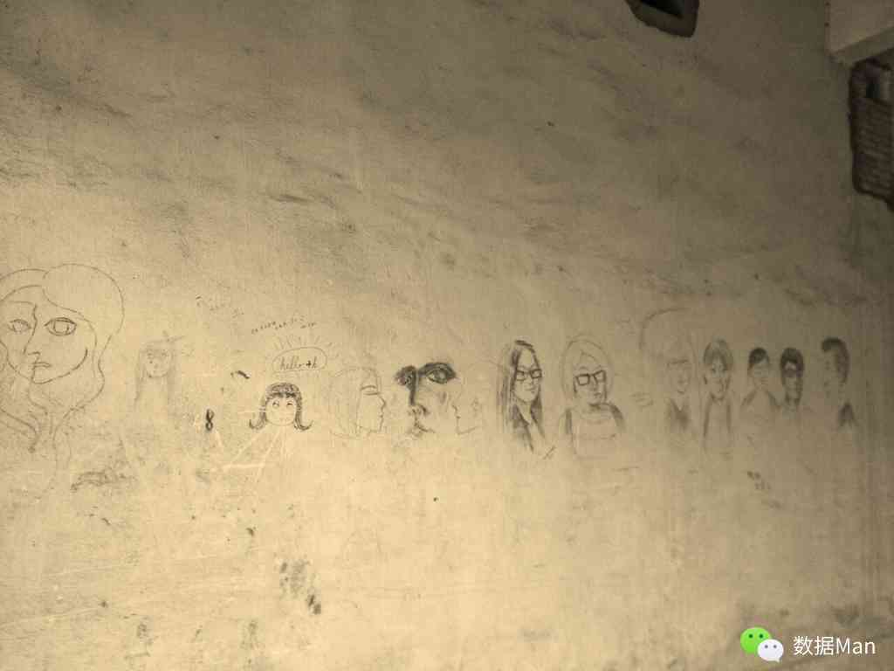
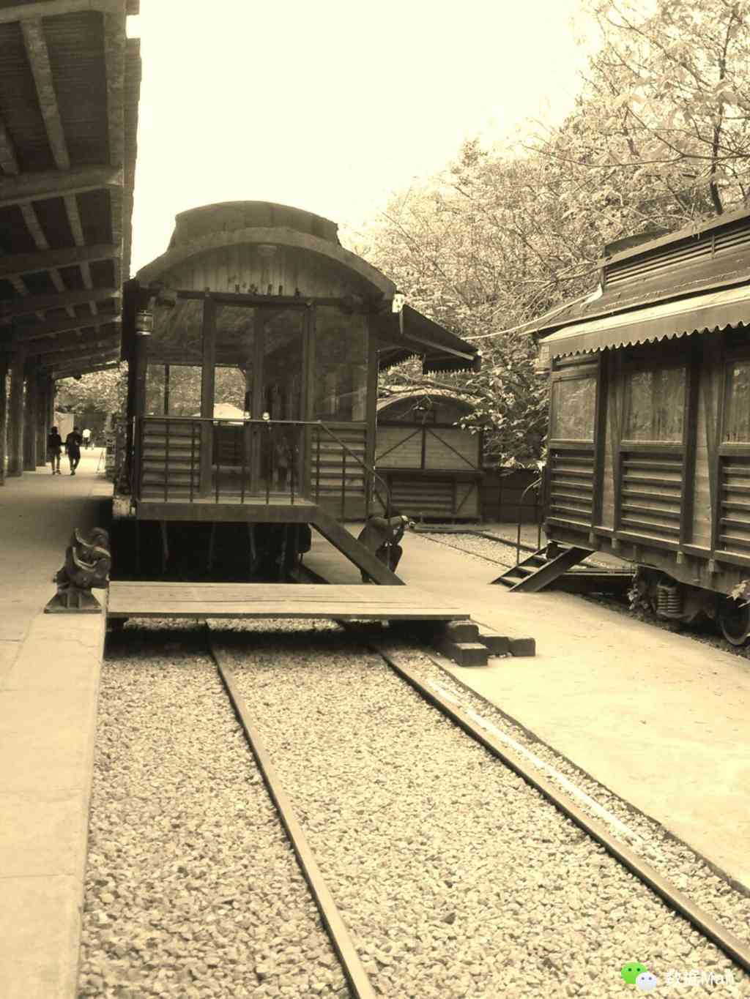

# 广州

> 行至广州，去到图书馆，随手翻起一本书，静下心来读一读这个城市，她到底带给我们什么......

在珠海和大学同学吃过饭后，他们就给我送上公交。每次看到这样与同学的告别，总有一种不舍，可是又为自己接下来的旅程感到激动，同时想到后来还会有更多的告别，心情真是复杂。所以别小看那么一刻的挥手，它会在你心中升起一种仪式感——嗯，我要走了，以后呢？不知道，但我会记住这一刻的!

一个人在陌生的城市里走着，带着那份早已适应此类生活的熟悉感，却想着在这里找到一两个与城市节奏不大能融合的地方，为此我在手机上发现了沙面和红专厂。

类似这种看上去反常的念头第一次出现是在我大三搬到了深处市中心的校区之时，那时候喜欢一个人在一个相对偏僻的教学楼里看书，这种喜欢甚至超过了在处于郊区的另一校区之中的感觉，也许是格外珍惜被喧嚣社会紧紧包裹住的那一丝宁静，也许是在追寻之前的那份与世隔绝，可真实的心境也许谁也说不清。

所谓的沙面——那是珠江冲积而成的沙洲，位于广州市市区西南部，鸦片战争后沦为英、法租界。这儿树木茂密，诸多的欧式建筑保存得比较完好且没有太多商业的影子。不过面积不大，一不小心就能走出去，可是走出去了你还想走回来，后来走得倦了，才离去。

在红专厂，我拿着此间文艺爱好者的必备神器——单反，成为了大多数中的普通一员，虽说仍是个小白用户，可即使是装出来的那份文艺，我也乐意且自我陶醉。

在这儿，我转悠了很久，拍了不少的照片，真是个练习摄影的好地方。看着那么多的摄影爱好者，有的人拍风景，有的人被拍成了风景，还有的人拍别人的风景被捕捉成了另一幅风景，而我，不知道会不会出现在谁的相机里呢？

因为此地同学读研的缘故，有缘又进入了好久未再踏入的大学校园。在校园里走着，看着周围经过的同学，再看看自己，好像也没啥区别，貌似找回了一点学生时代的感觉。可又在那一瞬间，又好像意识到自己已经不属于校园了。有时批评中国大学与社会的不接轨，但是真正到了社会又会怀念大学里那无知却美好的时光，这时候更多的反而是对有这么一个阶段而无比怀念和珍惜。

晚上住在同学的大学寝室，看着周遭的“室友”，想起那些个通宵畅谈的欢乐夜晚，睡着了，梦里便要一个人踏上去往湖南衡山的征途。