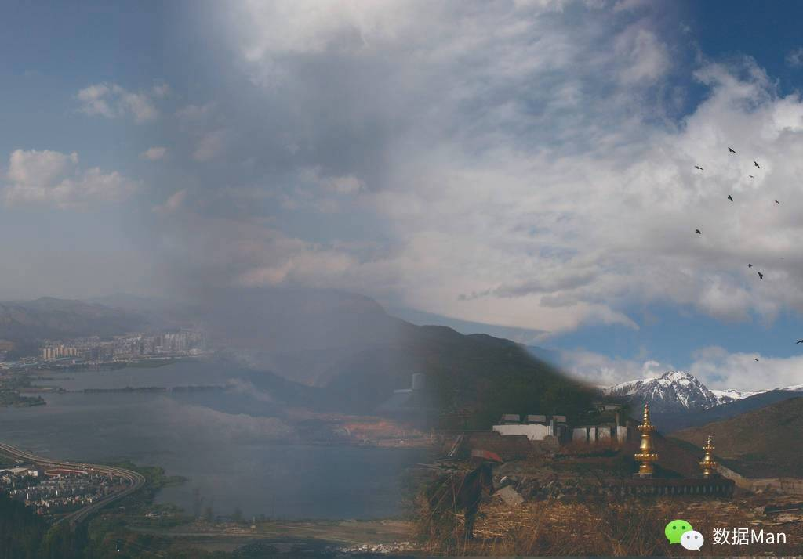
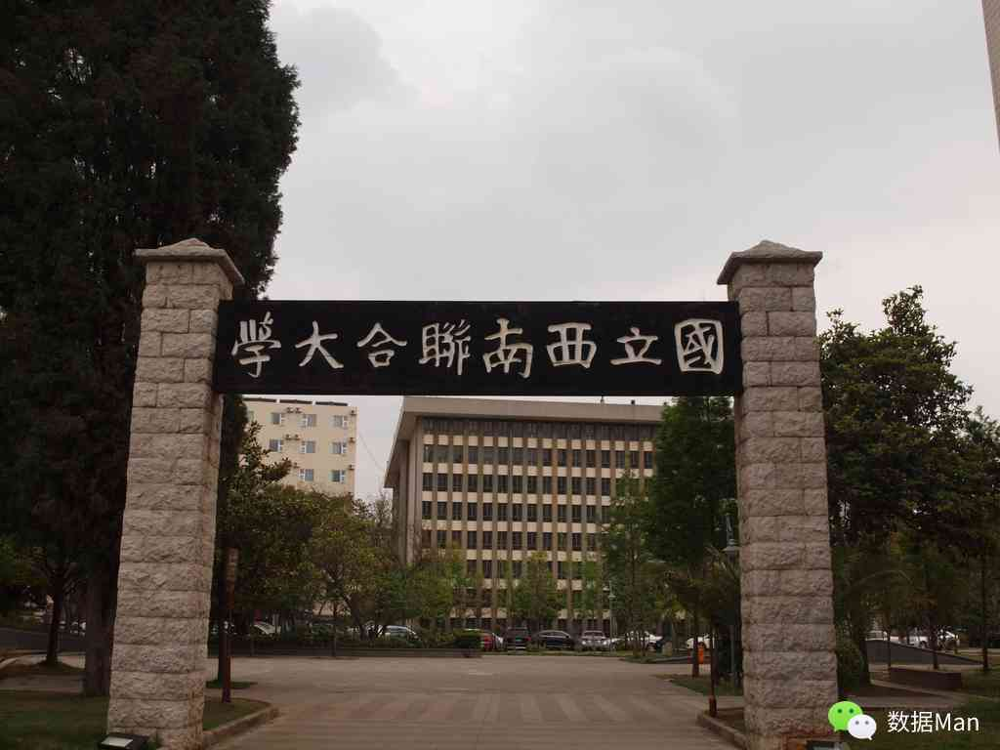

# 昆明

> 从桂林到昆明需要20个小时的火车车程，幸好买到一张下铺的车票，另外我在广州同学那拷来的kindle 版的《平凡的世界》让我轻松地消磨了时光。有人喜欢在旅途中就看旅行小说，可是我觉得那好没意思，这种书应该是在出门之前看的，一旦出了门你所有的见闻都应该来自你自身而非书中的引导。而《平凡的世界》则不同，他所描绘的是另外一个世界，是一个对当下我这般的年轻人很陌生的世界，他讲述了一个家庭的生存发展的故事，这与我在路上不断前行的事实貌似有那么一丝相通之处——无论好坏，都在往前走，有遗憾和茫然，但不止步。

我在第二天（3月30日）的中午12点左右抵达昆明，为了方便定的青旅就在火车站旁边，很容易就找到了。这儿的老板是一对青年情侣，记得好像是本地人，也许不是，反正挺是热情，水果饮料自取。当和几个室友及老板他们坐在沙发上看电影和闲聊时，感觉十分的温暖与自在，也因此我开始向出门独自旅行的朋友们建议找这般的家庭式的青旅，它会带给你家的感觉。

吃过饭，和同住这儿的驴友悠悠一同游玩滇池和西山。这个滇池的水很是浑浊，倒是与大多数城市公园里的湖水一般，容易让人反感，特别是一阵夹杂着腥味的风迎面吹来，不禁心中作呕，想必是桂林的山水惯坏了我的呼吸道。不过呢，这儿有不少人工饲养的海鸥，当有人喂食的时候，引得一群海鸥展翅飞翔从你沿跟前掠过，也算是一幅挺美的画面。

随后沿着滇池的岸边走着，不一会儿看到有缆车通往西山，于是买了票上了西山。这是一座很小的山，也无太多可开发的景点，因而就连路上的指示牌都是不多，不过我们七拐八绕还是到了山顶，有个观景亭，这儿能够俯视山下滇池附近的城市风貌，沐浴着春风和微暖的阳光，显然空气还不够干净，有些尘雾，否则应该看得更远些。

对于昆明，除了“春城”的印象之外就是抗战时期这里曾作为大后方的学术中心，融合了北大、清华、南开三所名校而成立了——西南联合大学，而我一直对那个时期的大学心向往之，当时这所学校汇集了不少的学者、专家、教授。现在那个遗址就存在于云南师范大学的校区之中，我想着能够拍摄到那个后来复制的刻着“国立西南联合大学”八个字的校门，也就算不枉此行了。

在这儿，我看到了给闻一多教授立的墓前摆放了新的花篮，让我想起了中山大学陈寅恪的塑像前同样有人赠送的鲜花，不禁心中掠过一丝感动。

一位大学教授在去世几十年后所谓“道德沦丧”“礼崩乐坏”“不尊重知识分子”的今天，依然有人在默默地悼念着他，真是一份难得的人文情怀。可是想到我对于这么不起眼的小事都能称得上是一种感动，是不是又算是一种很大的悲哀呢？对此，悲观者和乐观者有不同的解释方向，没有对与错，只要是为了这个社会多添一点尊崇文化人的氛围都是好的。可是在网上，众网民干的好多是摧毁一切的事情，那里我们看不到任何的信任，也没有任何人和事让我们敢于让我们相信。不过我们在说道网络的种种不好的时候，其实是在对此注入了更多的希望，希望是一个安静文明的地方。而事实上在现实社会仍然有诸多限制的今天，网络无疑成为了人们发泄和解闷的重要领地，那么由此我们期待它成为一个和谐的虚拟世界必然是徒劳的。其实这个世界应该容许有灰色甚至黑色的地带的存在，因为人性中本来就有正与邪，且一方不能完全战胜另一方。因而在容许灰暗地带存在的同时，更应该加大工作力度的是应该在国家层面对此进行立法监督，从而在制度上限制住，而不是一时一阵的活动小组式的打击行动。

想的有些远了，回到昆明吧。

晚上我们回到青旅，同悠悠以及在路上认识的凌峰约好一起去大理。