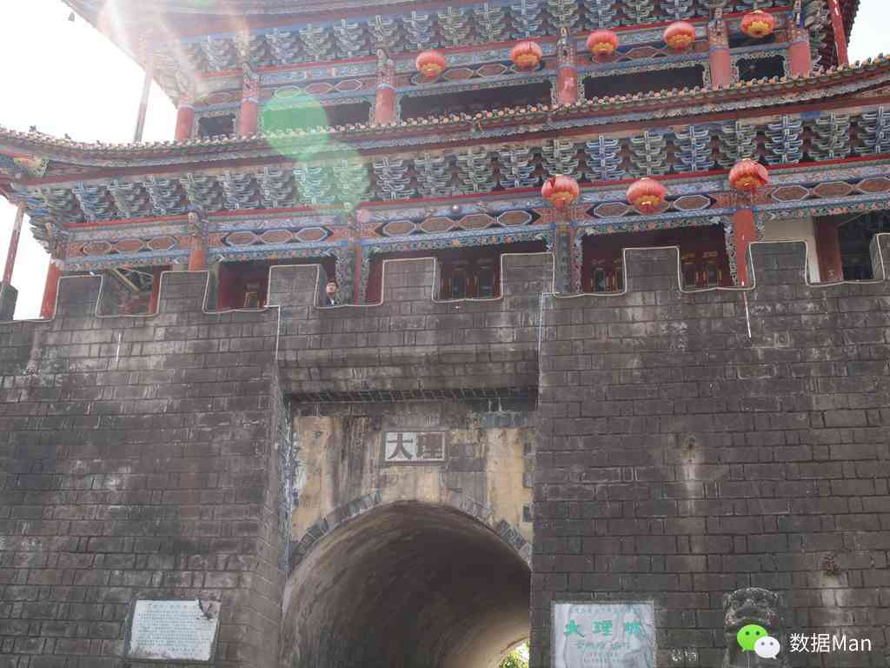
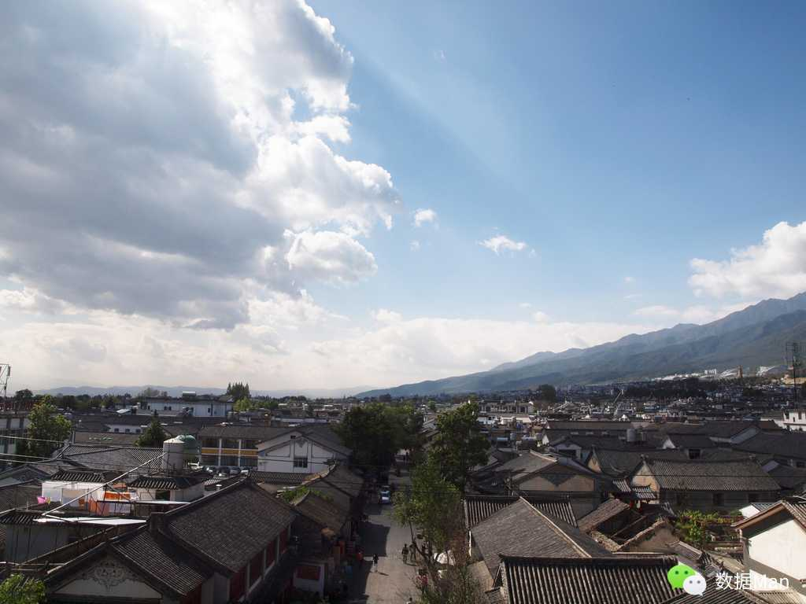

# 大理

> 我们在愚人节那天的早上7点钟到达大理站， 在火车上睡过的一夜本该是疲劳的。可是此刻——开始精神上有点恍惚， 作为一个宅男今天居然来到了郝云在“去大理”唱的地方。那种难以抑制的兴奋让我精神抖擞， 即便在接下来的一个多小时里背着两个大包挤在公交里也是很快乐的。

还记得刚下公交，刚进古城的一刻，抬头看到前面不远的山上笼罩着雪白的云彩，简直美呆了。其实后来发现这样的蓝天白云在这儿再常见不过了，可是让我一直记忆犹新的就是那一瞬间的所见。

在找到定下的青旅之后，在大理古城中优哉游哉，从这儿开始听到丽江小倩的《一瞬间》。好多卖手鼓的店里的老板都选择这首歌同时拍打着手鼓，看着他们悠闲自得的样子不像是在推销，可是后来发现他们是在单曲循环之后我就不得不佩服其敬业精神了。这首歌的名字我是回到上海百度后才知道的，原来这首歌在几年前就已经红遍丽江、大理了。不过一首歌这么一遍又一遍地听着不得不产生厌烦，而在我码这些文字的时候又单曲循环了这首歌，试图找回当时的感觉。

随后，我们出了古城去到附近的三塔寺，不用说，这儿的风景也是极美的。下午我们一同去了苍山，这个便是我刚来时抬头看见的山。而我们来的有些晚了，于是在山上走得比较匆忙，结果没想到山里的天气变化莫测，居然还下了十来分钟的冰雹，我也是醉了。随后我们更是加快步伐，虽然说走得很急，但是在上面可以看尽大理古城的风貌，甚至可以远眺洱海，也不算是枉来一趟了。

随后的日子有些不太如意，因为在这天的晚上吃完饭后回到青旅，肚子不舒服，怎么也睡不着，最后弄得是上吐下泻。于是在早上起来后便没有和他们一起骑行洱海了，不过好像一个人的时候变得更加安静些了。

这是在大理的第二天，我于是待在青旅里，看看《平凡的世界》，和老板聊聊天，或是在古城里任性地走一走，其实也是挺美好的，还不用到处折腾。我开始有点理解了在昆明青旅中遇见的那个女生说她在丽江待了一周都没去什么景点，就在古城里转悠。在大理这家旅社同住的还有几个年轻人，不好好像大我几岁。他们在大厅里编织着一些小的工艺品，然后会拿出去在游客多的地方卖掉。听老板说他们已经来此一个多月了，不过不要小看他们那些工艺品，就算是摆地摊也能维持他们不错的生活。而在此之前有个小伙更是厉害，来到大理打了一个月工，便赚了两万，于是买了一辆摩托车骑行去了，这让我感觉有点“驾鹤西去”的意思。这听起来不正是很多人所梦想和崇拜的生活方式吗？不过老板提及这些人的谋生能力都是很强的，能很快适应各种环境，不少人还是难以做到的。

以前看网上有这样的人存在时，更多想说的是：“我要是能像他们那样该多好，我也应该成为他们。”而在这里亲自听人说起真实的事情，我便会考虑将自己代入的可能性。首先你会想想自己有没有这样的谋生能力和勇气，而我认为能力是排在勇气前面的，光凭着一股之气可能会撞得头破血流，到头来还可能难以获取所希望的生活。不过要是你愿意承担这样的后果也不是不可以，只是我知道现在的自己是难以扛住这般的风险的。

另外还有个关键的问题——你是否真的就是喜欢这样的生活方式，如果不是那么就没有之前那么些个探讨了，可是要搞清这个问题，就得问问自己的内心了，而这也不是那么容易的事。

这时不得不说自己很幸运了，我在从桂林去往昆明的火车上开始读《平凡的世界》，而这书中写得也正是平凡人的平凡生活，但是同样有不少精彩可以数点，而这平凡的生活貌似也正是符合我个人的性格特征的。无需大风大浪，即便是简单的柴米油盐，只要有颗热情不惜的心，照样能收获属于自己内心的那份精彩。关键是不用再去羡慕他人的生活方式，你要去做的只是往自己希望的生活方式去努力并经营好这便够了。

到这里，我终于发掘出了旅行于我的最大意义——给自己一个空白期，来弄清自己的内心真正的渴求，但无需苦苦的思索且这样也是徒劳的。有时候就是需要一个契机，让你醍醐灌顶、豁然开朗、如沐清风。

在身体不适的时候，内心却得到了一种极大的解脱和放松，不得不说真是很幸运的。

在晚上凌峰和悠悠回来后，我便一起买了去丽江的车票并且订了那边青旅的床位。就这样，再一起去丽江。