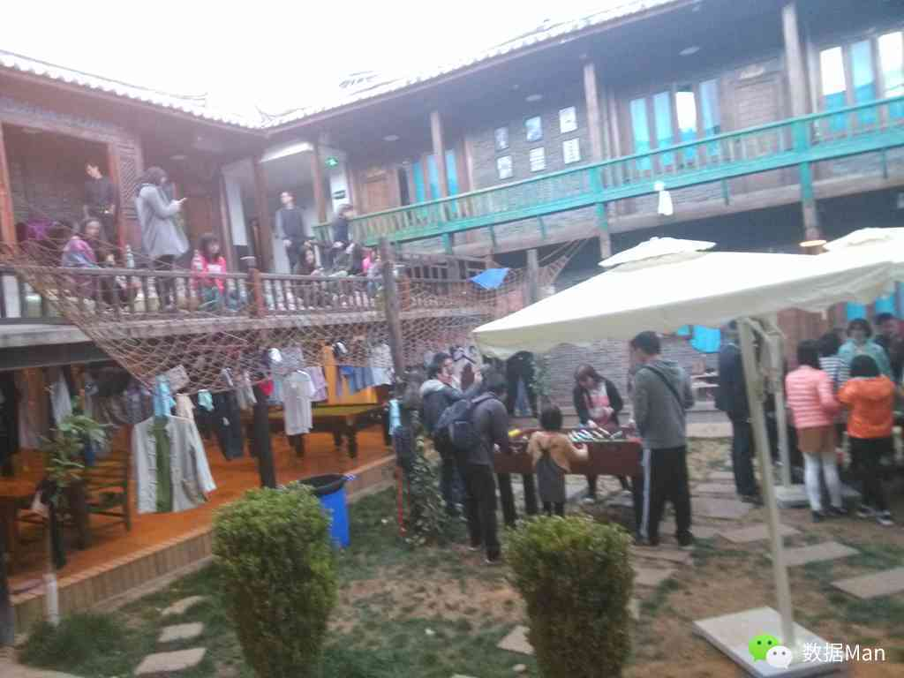

# 丽江

到达丽江时是4月3日的中午12点左右，再转了两趟公交花了2个多小时之后终于找到了小良推荐的挺偏僻的背包十年青年客栈——这是由《背包十年》的作者创办的，坐拥三个院子，这里有露天电影院、24小时书吧、酒吧等，完备的硬件设施加上丰富的活动让人不由地在此多逗留几日。

下午下着一点小雨，我们便只是在束河古镇里转悠，虽然说起来只是个古镇，但却感觉比大理古城要大很多，也许是更加精致的缘故吧，这里可以待得更久些。然后又听到了那熟悉的《一瞬间》的旋律，真是让人快受不了了。

在这里不出门就可以很舒服地度过一天，另外这儿比之北京时间有一个多小时的时差，所以早上10 点起床也都不算很晚，这儿好多人都是这个点起来，然后慵懒地度过一天。我在这儿由于身体还没完全恢复，加上不想出去走动，于是就对凌峰和悠悠说：“你们去玩吧，我还不太舒服，就在这青旅里看看书算了。”

于是就这样，再次打开我的kindle，有看起了《平凡的世界》。我在咖啡厅寻了个靠窗户的座椅，刚好阳光能够晒进来一点，暖洋洋的，甚是惬意。这种感觉不禁让我怀念起了大三的时候，有那么两个多月时间就一个人带着一本书、一根笔、一个本子、一个茶杯坐在人少的西教学楼的教室里，一待就是一整天。在这里，我找回了全身心看书的感觉，于是看到动人处，居然哭了，不过至今也记不起是什么样的情节让我如此动容。好在当时身边没有什么人，否则真是尴尬哪。到此时，我毅然决定旅途结束后一定要买回纸质的书再看一遍。当然，现在我已经买回了，在看了。不过呢，貌似没有在路上看的时候那么带劲。也许是那种“读万卷书”和“行万里路”在同时穿插着进行的时候，才会有当时那特殊的情感迸发吧。

晚上，这儿搞起了露天烧烤，可惜肠胃不给力便放弃了，果断还是安静地看书吧。直到有些饿了才下楼出门买点零食回来享用，回来时看到一个胖子相拥着几个小伙伴，他们站在露天的平台上，拿着话筒说起了这几天认识的几位身边的好友却要在明天一早分离，讲了一番让人动容的告别之说，随后又合唱了《朋友》。此番情景，让人感动，我不禁想起了那句话——我们一直在努力地证明着自己可以独立，然后最终发现这路上也需要彼此依偎。

晚上，凌峰和悠悠告诉我，他们在明天一早即将离开这儿，而我后天将会一个人去往香格里拉。虽然之前便已知晓，可是在那一刻即将到来的时候还是挺难受的。说起来我们几个人在昆明认识，一起到大理，又来到丽江，也是挺难得的。此时要离去，虽然没有像台上那位胖子那般将情感流露出来，而是放在了心里。

原本是准备在明天一早去香格里拉的，可是昨天看天气预报的时候发现香格里拉的温度在10 度以下，而且还有雨夹雪，而我在福州就将秋衣秋裤给丢了，正好这儿待着挺是舒服，于是又续了一晚。白天去市区里买了套廉价的保暖内衣，顺便看下古镇之外的丽江风光。

如此这般，丽江中慵懒悠哉的三天的生活就要说再见了，不过我一定还会回来的，下一站——香格里拉。