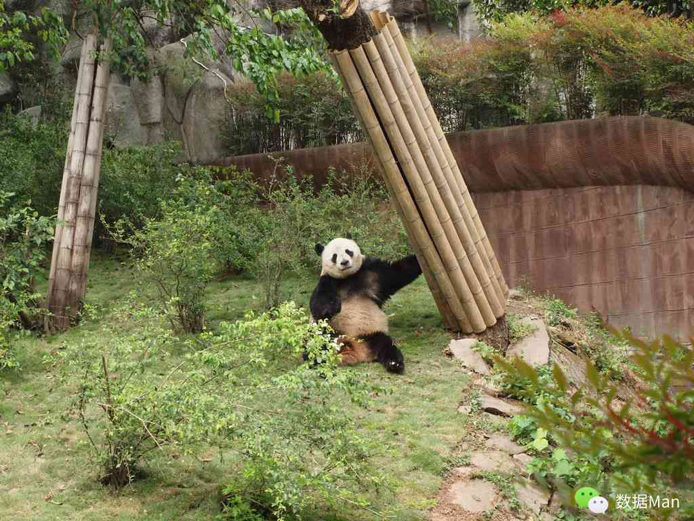

# 成都

> 在成都同学家里住的那些日子过的很是舒服与安逸，每天睡到自然醒还要再自然睡着，然后再眯一会，实在睡不着了才起身，然后叫醒我那更能睡的同学出门寻吃的。那些天我几乎没带相机，留下的照片不过十几张，拍的也就是在大熊猫基地的。

来到这个天府之国，游览景点的目的也是为了满足一张嘴，在这里，就要承担起“吃货”二字给你带来的责任和意义。

为了能够有充沛的体力出门觅食，我住同学的家里往往睡到近中午时分才起身活动。记得第一顿那个48元的套餐，上来十几个别致的碗碟，盛装的是各种当地名小吃，由于花样较多，只记得有钟水饺、担担面、红油抄手、赖汤圆、鸡丝凉面、蛋烘糕、银耳羹、酸辣抄手、三合泥、甜水面、叶儿粑、渣渣面。此外蹄花、串串香等等等等的更是一一不能放过。

对于这些美食，有一个很大的共通之处就是辅料很重要，比如吃麻辣火锅时至少要有三样辅料——香油、蚝油和蒜泥，再如那个老妈蹄花如果不拌个麻辣酱便很腻味。因此才有人总结说成都美食精彩在辅料，可我便因此觉得这样是不是本末倒置了，丧失了原汁原味的那份自然？可我在一细究，发现这几个字是经不起推敲的，到底什么才算得上是真正原汁原味的呢？也许从来也没有过，所以还是回归最初舌头告诉你的直觉评判标准吧——好吃就好！

当吃到此处，真觉成都人对吃的功夫不止一般，他们不满足于传统的花样口味，还不时地翻陈出新，给此地的人们的味蕾带来持续的刺激与享受。另外，我注意到这个城市餐饮的一个细节——不给预定，要吃就得排队。这样的霸气应来自于各家店铺的极大自信和顾客的青睐吧。身为外地人，我也慢慢接受了这一规则，且理解为“吃的代价”。除了吃之外呢，成都人最钟爱的莫过于麻将啦，周末叫上几个老友去郊外搓一顿，罢了来一顿火锅，划拳、谈笑，多么畅快的市井生活哇。

就整个旅途来讲，成都无疑是最为放松的一站。都说“少不入川，老不出蜀”，这里安逸舒适的生活不由得让人如痴如醉，大抵我是不适合此处的。当然即使身处这般的大环境之下，你依旧是可以有选择自己生活方式的自由，只不过会来的艰难些罢了。

转眼间，就又写了一个城市了。其实虽然这么说，但是当时的感觉是很慢很慢的。而今回忆的时候，在即将完成对整个旅途的记忆的梳理之时，却突然想慢下来，好像之前的那些城市与我之间真的就是渐行渐远了。也许是在梳理的过程中，将之下意识地在记忆中封存了。虽然“封存”这个词用得有些过了，但确实感到那些日子离得远了，那种自由散漫同时对生活对人生充满疑惑，想试图寻找什么却又不知到底要寻找什么的不知所措也离得远了，不过倒也格外珍惜那段只属于自己一个人的时光。