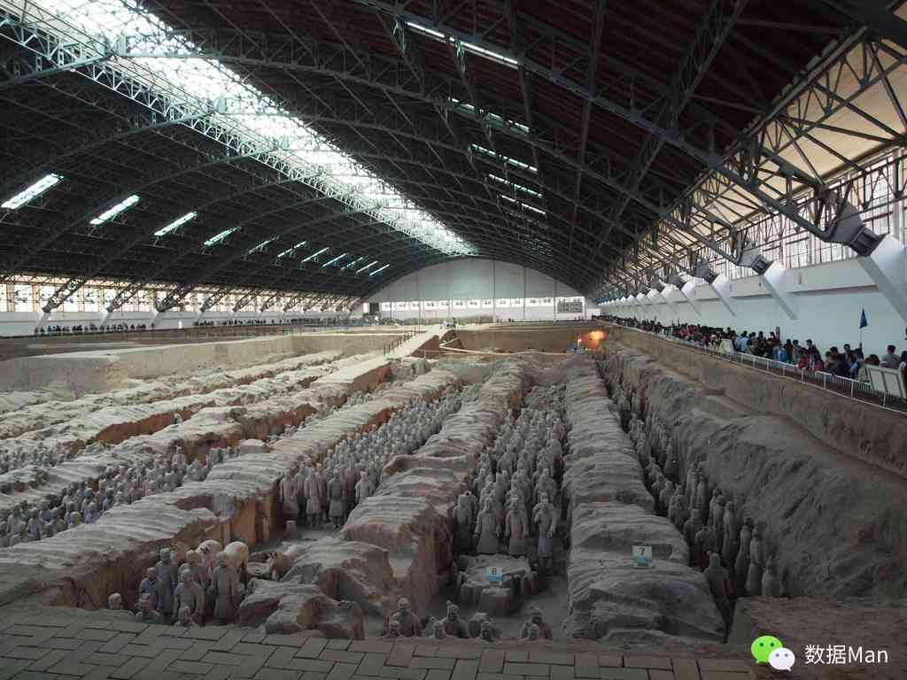

# 西安

> 刚到西安的那天，走在古城墙外，用相机攫取这座城市和这儿的人的一些瞬间。原来，我又来到另一座城市了。我将在这儿度过同样不过几天的时光便又要径自离去。

西安，这座位于中国西北部的城市，不光吸引了陕南和陕北的人，更有不少宁夏甘肃的人来此谋生。如果不是中心的古城墙在时刻提醒着你的话，这样一座现代化的城市，怎么也让人难以想象居然承载了那么多代帝国君王的故事。看到兵马俑的一号坑，那最早只在历史教材上见过的景象摆在了面前，仍然不由地惊叹如此浩大的工程。在现场可以看到几个工作人员在慢条条地进行着清理拼接那残缺的兵马俑的身躯的工作，由于技术保护的难度，还有好些没有挖掘出来。当徘徊在陕西历史博物馆内，就那样慢慢地走着，小心翼翼地防止与密集人群的接触。想给自己留一点空间，试图让这些个经历周、秦、汉、唐等朝代的各种文物将自己代入那古老的封建文明的中国，却显得那么吃力。我于是放弃了，匆匆过眼，正如浩瀚历史中这些也只是短短的几页。

从南门上古城墙之前，是要经过护城河的，这在古代是唯一的入口。作为一座久经战火洗礼的城市，古城墙也在各朝各代经过了不停的修缮，建国后在1983年开始进行了一次大规模修复，墙体维修加固工程按照“修旧如旧”“不改变文物原状”的原则，按照清乾隆年间的墙体结构规格修复，到1990年底基本完工。由于城墙的厚重坚固，使得如今成了旅游甚至跑步健身的一个极佳的场地，我有幸在西安的最后一天参加了由伊利举办、打名“奔跑吧兄弟”的5公里跑步比赛。从南门跑到西门，再折回南门，那天下着蒙蒙的细雨，在路上还遇到别的公司同样为宣传自家产品而搞出的类似的奔跑活动。汗水、雨水浸透了我的T恤，然后又湿了套在外面的活动服。跑着跑着，我仿佛回到了在上海时公园里跑步的时光，可是想想此刻突然觉得很是不可思议——我居然在异土他乡与一群不认识的人一同跑步，终点还有同行的驴友在帮我拿着行李，给我计时等着我回来。这一切的一切，怎么想，怎么觉得不真实，也许是在跑步过程中释放出多巴胺的促进下更让人觉得此刻的虚假。可是如果这是假的，那么还有什么是真实的呢？

除了体会这座城市的古老韵味，我把不少的精力放在了这里的美食。那几天的早上，一定是找最近的 biangbiang 面的分店吃上一碗。西安的面食应该是最好的，在这里吃的臊子面、羊肉泡馍等等都是极其入味的，就连那平日里难以下咽的馒头在这里也是那么的可口，而且管饱哇。特别是在回民街——这个全由回民经营、具有浓郁清真特色的美食小吃街，你可以做个幸福的吃货，不过要小心身上的手机、钱包等财物。

这座城市除却带给我的陌生与新鲜之外，还有与熟悉的大学同学的短短相聚，说笑着以前大学的时光。

> 在乘坐飞机经过城市的夜空之际，贴着窗户能够看到远方的灯火，似乎能看出哪儿是我住过的青旅的方向，而与此同时我与这座城市的缘分也就在此刻作罢，正如之前走过的那么多的城市一样——你与她才刚刚认识，还未来得及熟悉彼此，却就要在下一刻告别。