# 华山

到了华山脚下的青旅，约么下午3点钟，闲来无事， 在看完了小说版的《平凡的世界》又看起了电视剧版的。看完了几集后，天有些黑了。回到大厅里，遇见了一位驴友，于是约好第二天一同爬山，毕竟有个伴总会让旅途多一份快乐与回忆。第二天，我们6点钟不到就出发，到达华山之后用几块饼干对付着便开始了这一天的攀爬。

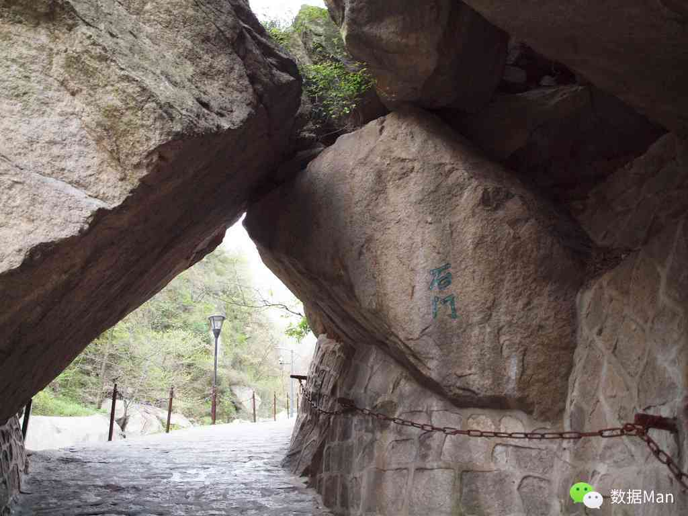

到达第一个地图上有标识的点是“五里关”， 因距离大门5华里左右而得名。再走一点到了“石门”，此处若有战事，一夫当关易守难攻，故华阴旧志称其为华山天险第二关。杨嗣昌《太华记》中说，两石如千斛钟，色黑如铁，中通行径，为华山铁门。

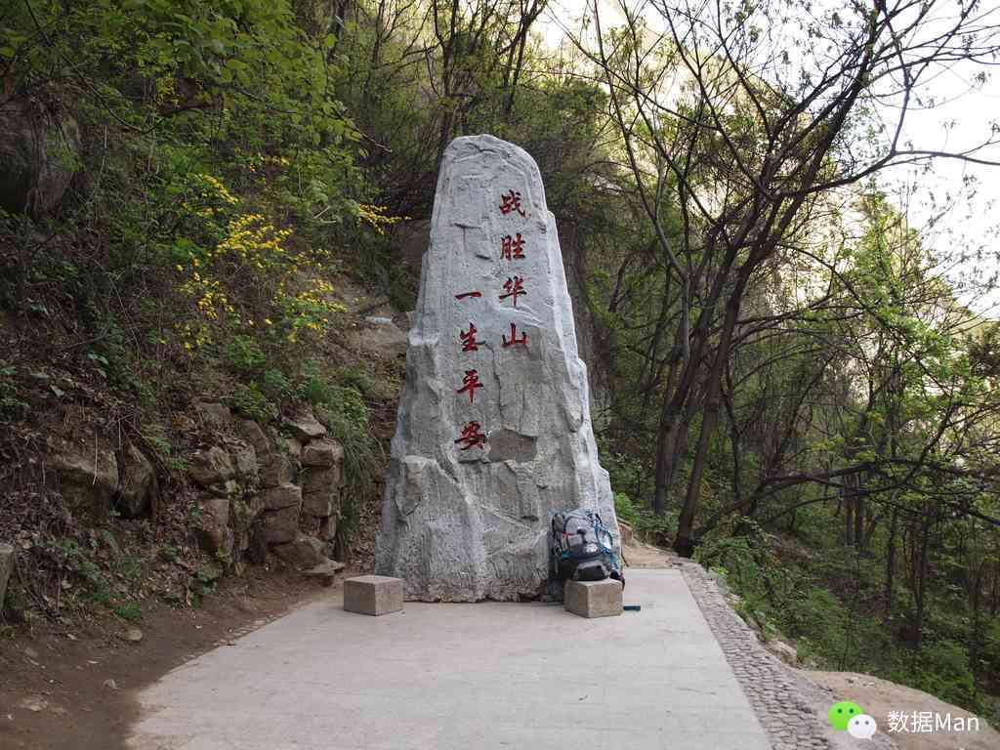

这块石头显得如此突兀，怎么看，怎么不舒服。我在想这个“战胜华山，一生平安”的标语是在鼓励我们一直努力向上，还是建议购买上面的平安丝带呢？

然后一路上经过响水石、云门、通仙关， 开始慢慢体会到一点——

华山石刻以摩崖石刻为主，是一个书法艺术宝库，被誉为镌刻在崖石上的书法博物馆。石上书法，行、草、隶、篆琳琅满目，各具特色。

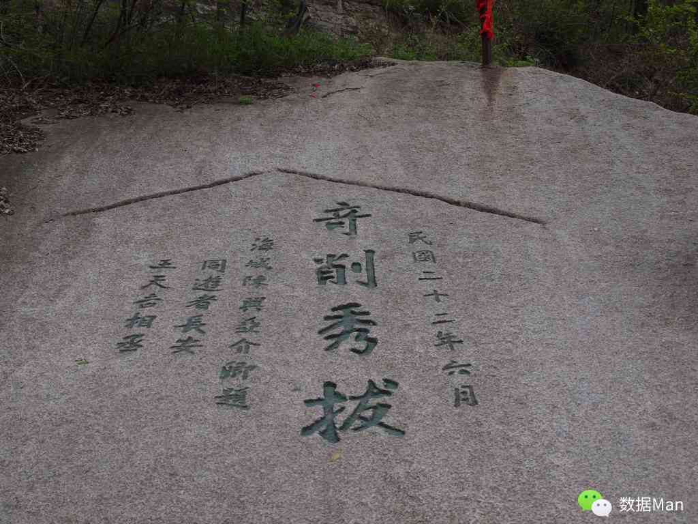

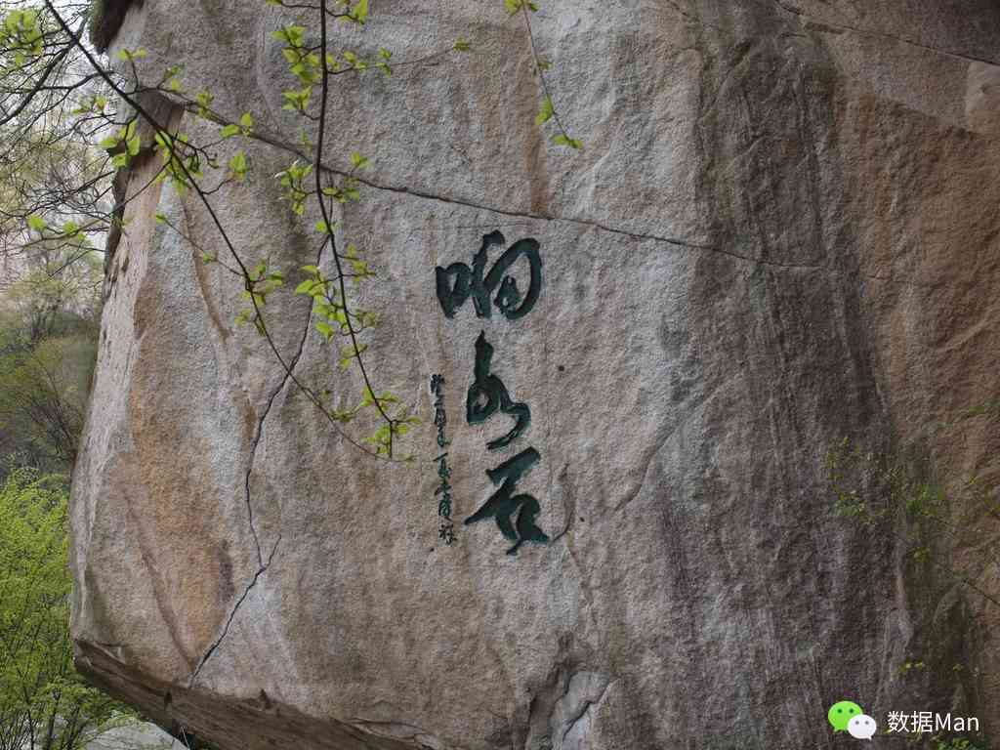

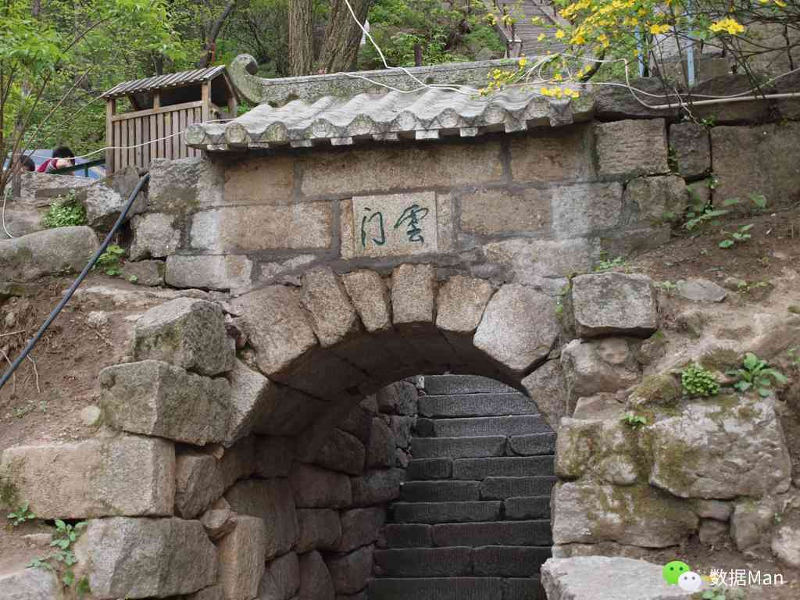

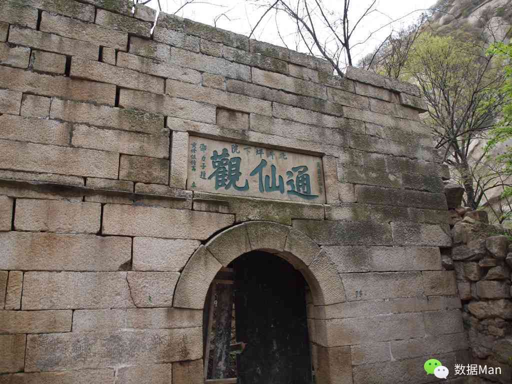

到了回心石，这儿有传说。

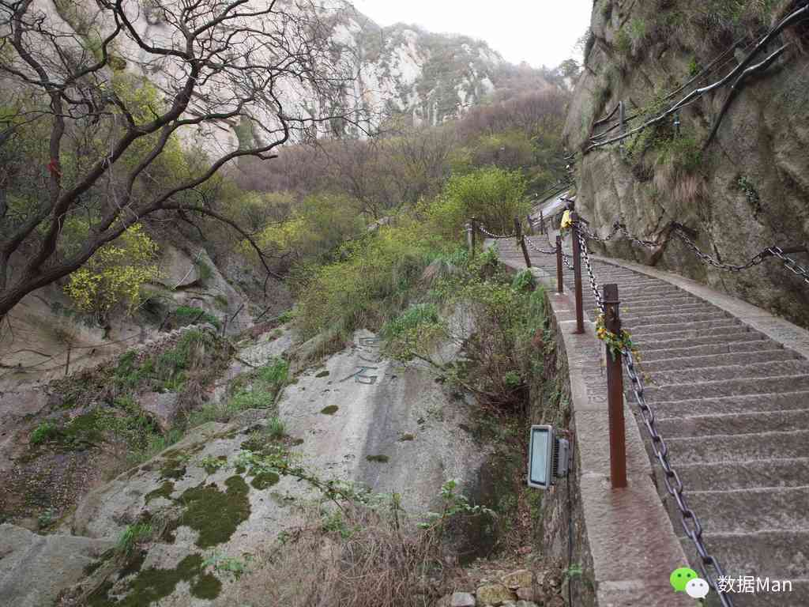

说的是元朝道士贺志真带领两个徒弟在华山开道凿洞，每凿一洞，就让给别人，这样天长日久，两徒弟就有些不高兴，认为，本想跟上师傅学点东西，现在不但没学到什么东西，而且天天吃苦凿洞，这什么时候是个头啊？这天，师徒三人在南天门外悬空造洞时，两徒弟心怀叵测，砍断绳索，眼看师傅坠入深渊。两徒弟随即下山，当走到“回心石”处与师傅相遇，因此已知道师傅已经成仙，不是凡人了，于是悔恨不已，决心回心转意，又随师傅上山修炼。

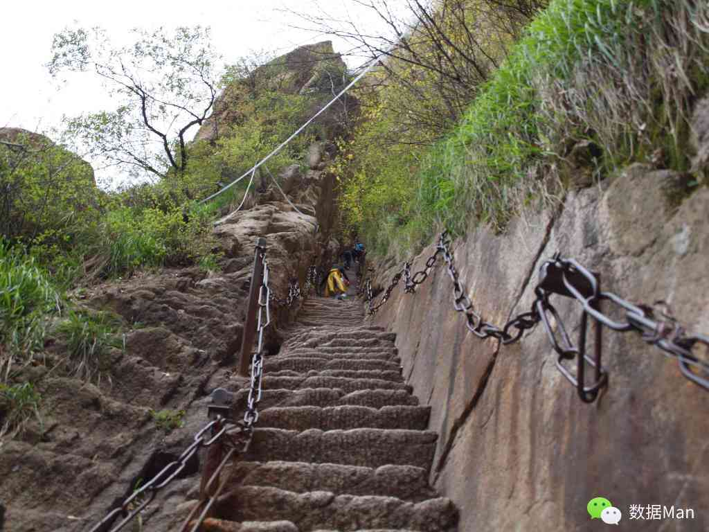

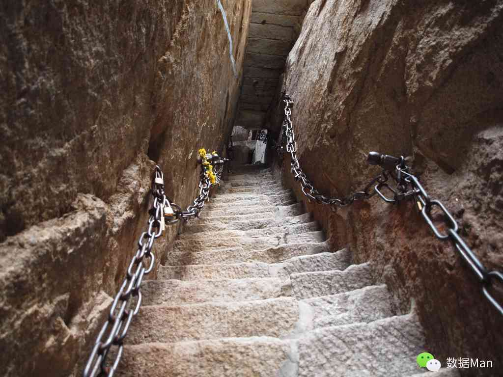

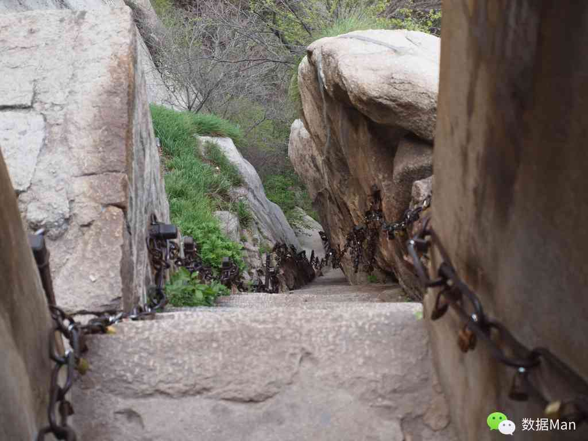

这儿一过，便是千尺幢，是为登华山的第一处险境， 石阶顶端有如井口，倘若把“井口”用铁盖盖住， 通往华山的道路便被堵塞，所以称之为“太华咽喉”。

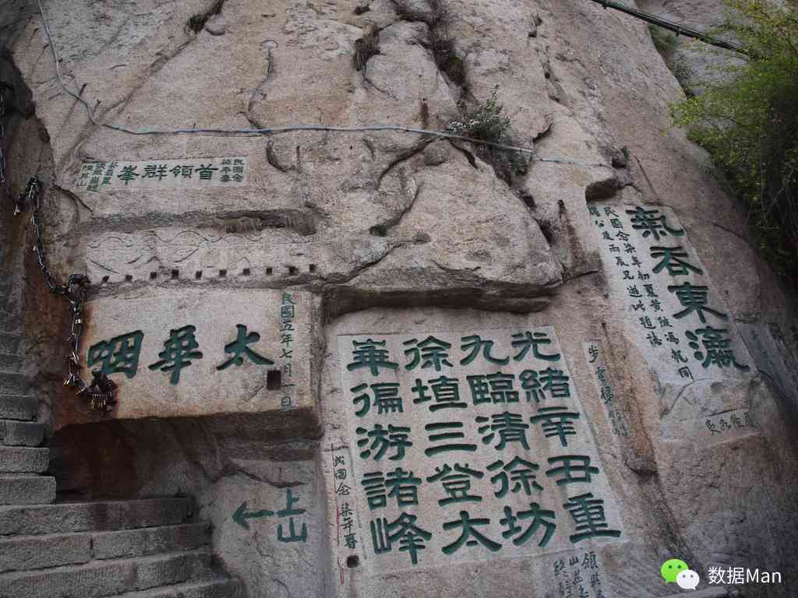

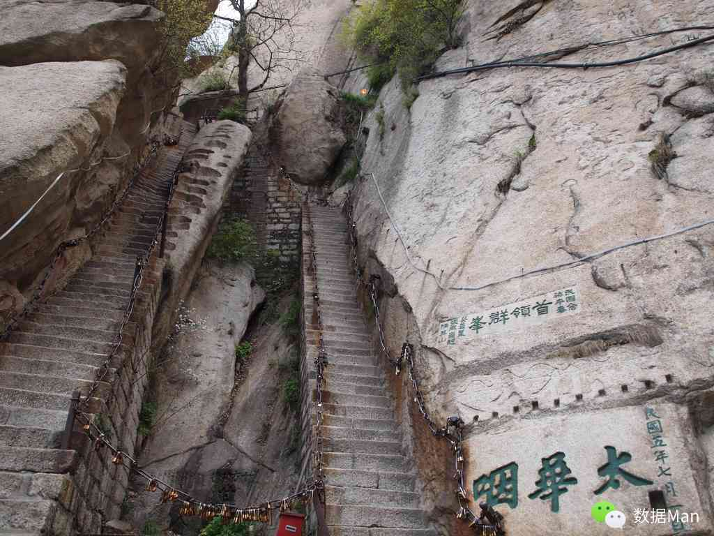

好不容易爬完千尺幢，到达一平台，可以看到民国时题刻的“太华咽”三个字，旁边的“光绪辛丑重九临清徐坊徐埴三登太华遍游玩诸峰”则是有这么一段背景——

光绪辛丑重九，即1901年农历9月初9日。徐坊，清代官员，字士言，号醒生。今临清人。曾为宣统皇帝之师。出身官宦世家，捐为户部主事。光绪二十六年（1900）八国联军侵入北京，两宫西逃，徐坊追随而去。光绪二十七年（1901）以尚书荣庆荐，越级擢升为国子丞。后为宣统皇帝之师。卒后为正一品封典，晋赠太子少保衔，谥“忠勤”，国史馆为其立传。

徐埴，山东临清人，晚清贡生，民国京城名士。其父徐延旭曾为广西巡抚，其兄徐坊为国子监祭酒，溥仪皇帝的老师，京师图书馆副监督。1928 年清东陵被反动军阀孙殿英盗掘后，末代皇帝溥仪派耆寿民、宝瑞臣、陈诒重、徐埴等前往东陵勘察护陵，并办理一切善后事宜。徐埴食宿在东陵现场三十多天，真实详细的记录了东陵残毁的情形，记载了捡拾赎回散落珍宝和护陵的经过，回天津向溥仪皇帝禀报后，徐埴得到溥仪皇帝赏赐。此后，徐埴将于东陵所见编成《东陵于役日记》一书。

华山南峰有另一幅题刻，“辛丑八月晓日，李经野莘夫，徐坊士言，（徐）埴士范重游”，时间在八月。也就是说，这一年里，陪着慈禧避难西安的徐坊、徐埴兄弟抽空至少爬了三回华山。

紧接着便是百尺峡，虽没有千尺幢那么长，仅46 米，石阶91 级，但仍是华山天险之一。这里势危坡陡，石壁峭立，通道狭窄，且有悬石，摇摇欲坠。游人至此都心惊胆颤。明顾端木有诗状其险曰：
“
幢去峡复来，
天险不可瞬。
虽云百尺峡，
一尺一千仞。
”

千尺幢、百尺峡的台阶都是从明末清初开始凿的，民国时几经加固，解放后又多次修整。一九八五年又凿为复道，游人上下各行其道。

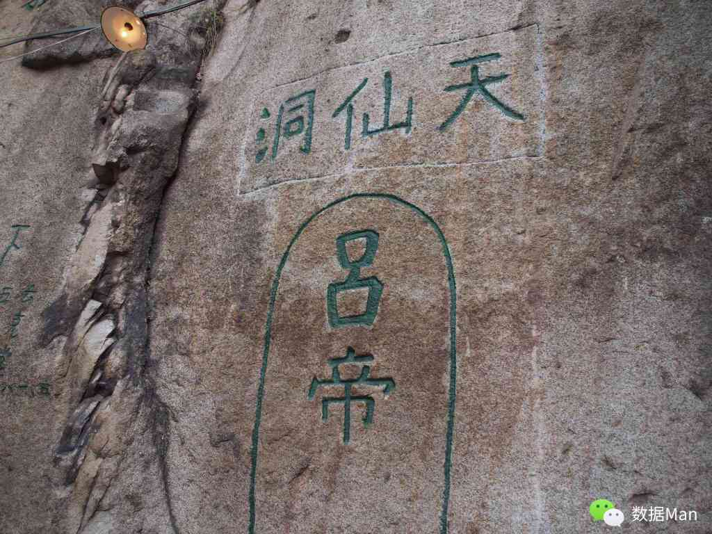

过了此处即见天仙洞，据说住的是吕洞宾，而之后的二仙桥的来由就是何仙姑在那碰见了吕洞宾，受他点化而成仙的地方。

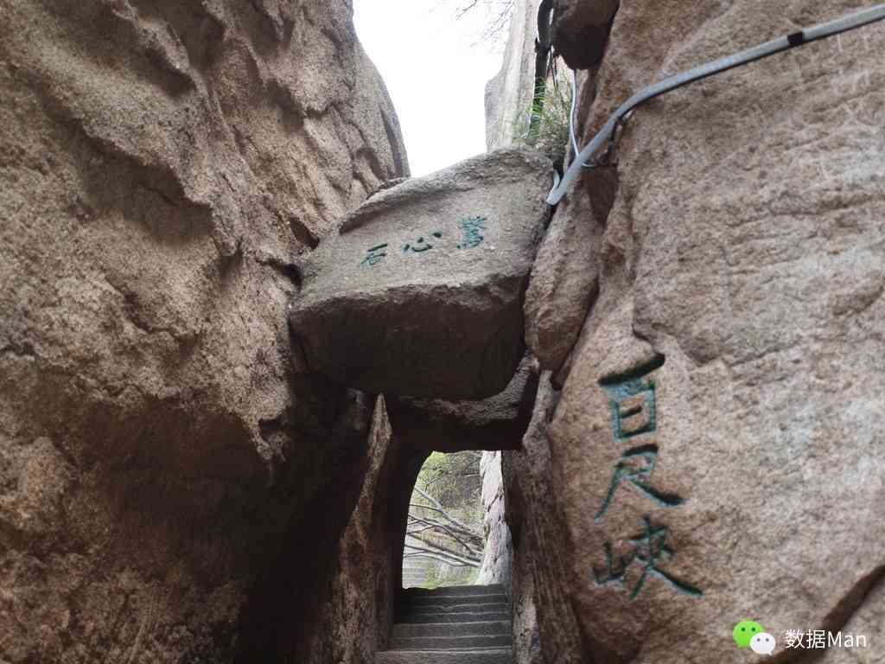

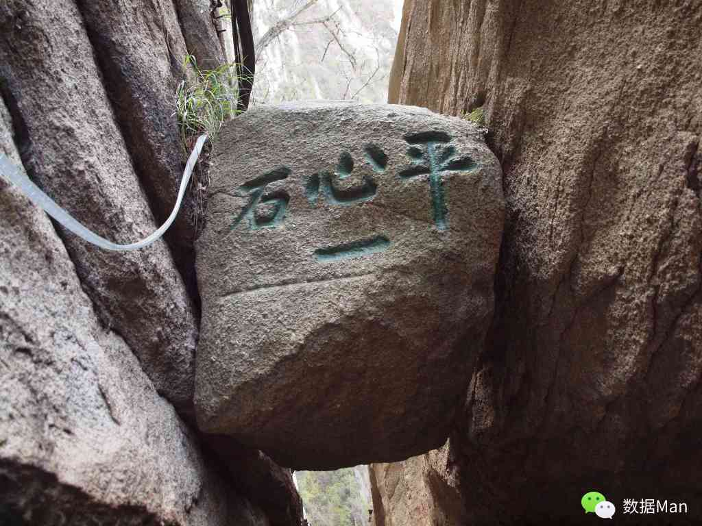

再往前走，两侧崖壁狭窄，被飞来的两块石头从中撑开，石隙只能容一人通过。人从石下钻过，生怕石块从两壁间掉下来，故称此石为“惊心石”。通过悬石后，心总算放下来了，回头再看，原来此处卡着的两块石头，是上大下小，故能安然无恙，后边的这颗石头则被称为“平心石”。韩愈诗中道
“
鄂然神功就，
杀气见棱角
”

而明杨嗣昌《太华山记》对惊心石更有生动记述：
“
峡中乃有大石，不知何自飞来，如欲堕涧而为两崖所挟迫不能下。又若惧两崖其灵异，斯为足惜……
”

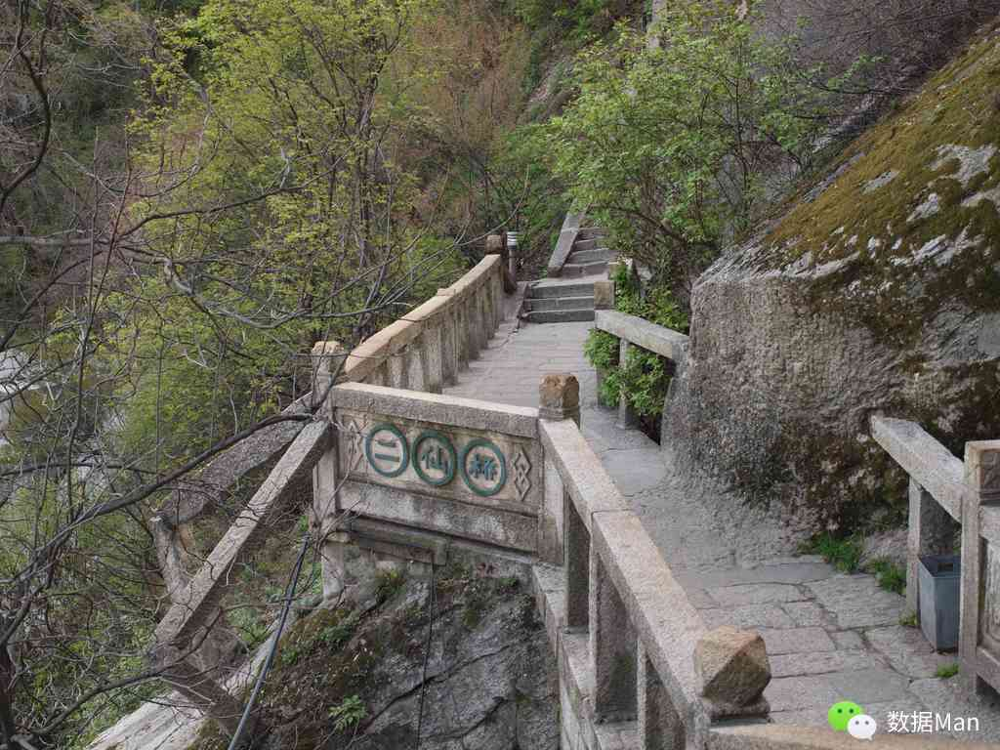

穿过百尺峡，行不多远，本已到了绝境，前无去路，幸得一小桥——二仙桥飞架凌空，联系二山，这才又于崖壁上凿出一小径上山。

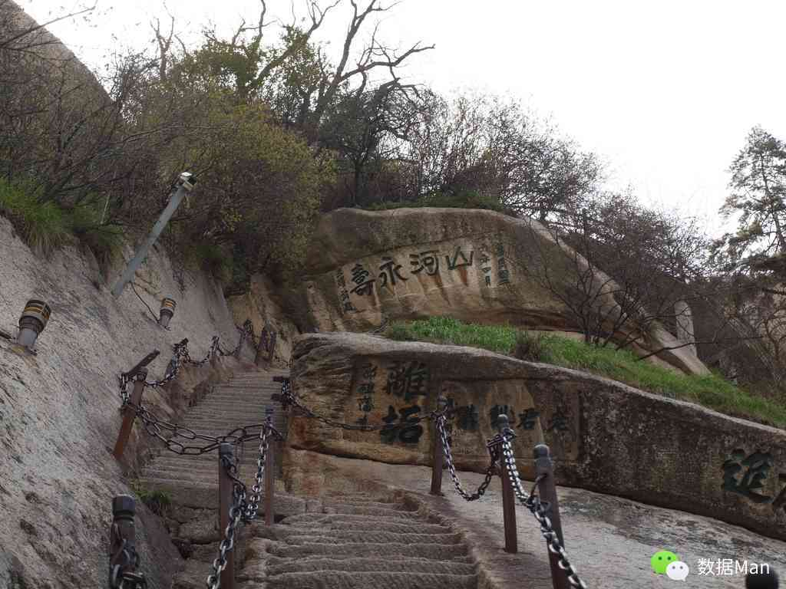

这儿又是一段险路“老君犁沟”，传说是太上老君牵来自己的青牛，在这个陡壁处犁出的一条小路。走完这段有500 多个石级的“老君犁沟”，就登上了海拔1500 多米的北峰。这里四面悬崖绝壁，恰如一座平台，因而又叫云台峰。

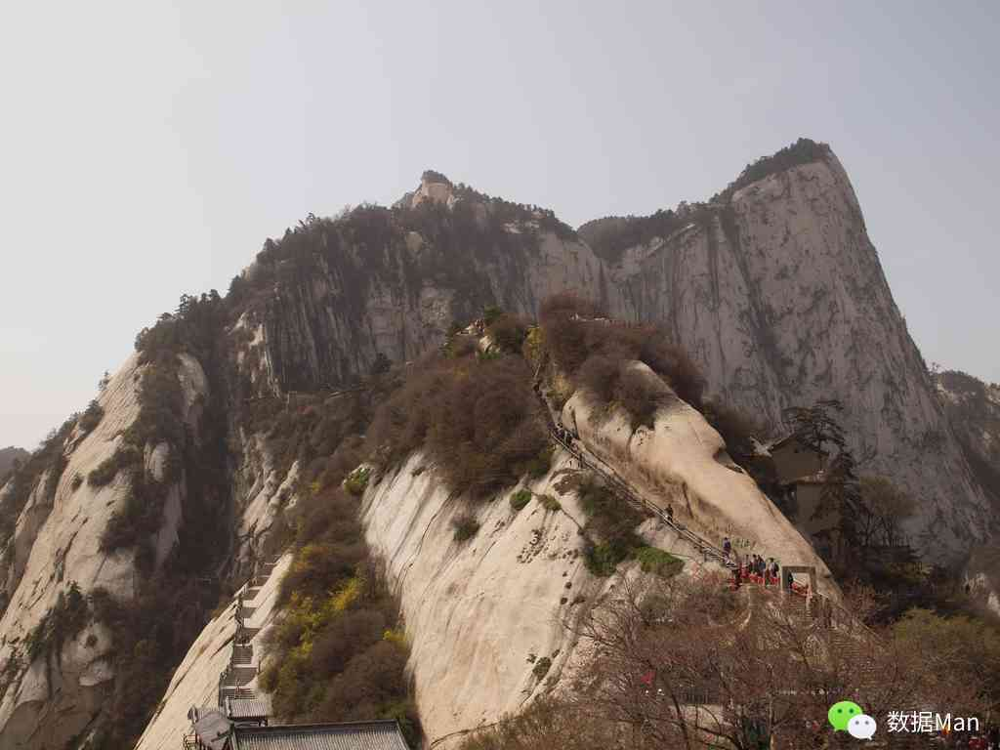

到了北峰顶，放眼望去，方得以俯览华山之险。往南走，最近的即是擦耳崖，要往其它峰去，必须打此经过。擦耳崖本来也是比较险的，意味着要擦着耳朵才能过去，现在路越来越宽，外侧还加了护栏, 安全了不少，但是味道也就少了。再往前走，是苍龙岭了。此处因岭呈苍黑色，势若游龙而得名。

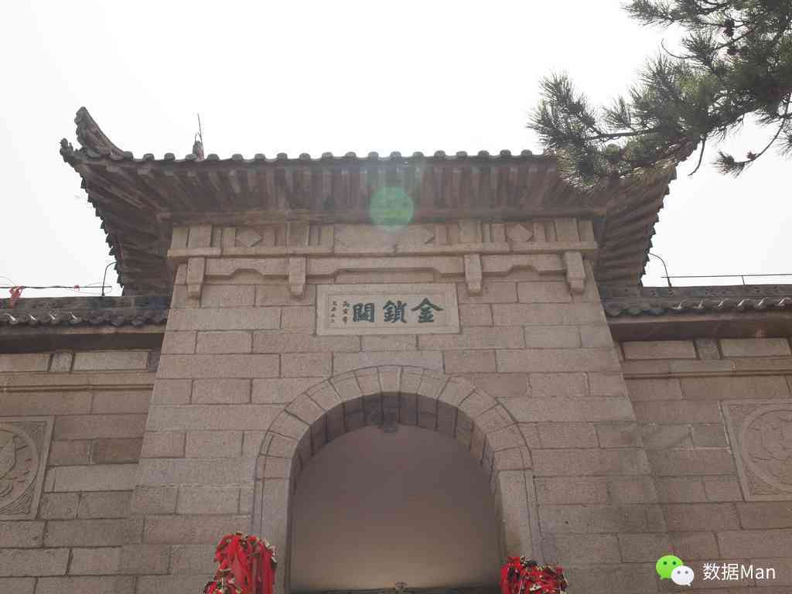

过一会儿便到了金锁关。这是建在三峰口的一座城楼般石拱门，是经五云峰通往东西南峰的咽喉要道，锁关后则无路可通。杜甫在其《望岳》的第二首关于华山的歌咏中“箭栝通天有一门”便是指的这里——

西岳崚嶒竦处尊，
诸峰罗立似儿孙。
安得仙人九节杖，
拄到玉女洗头盆。
车箱入谷无归路，
箭栝通天有一门。
稍待秋风凉冷后，
高寻白帝问真源。

过了金锁关便到了玉女峰，这时候又见到了这块署名“金庸”的“华山论剑”石碑，在之前见到同样的石碑时还以为那是唯一的一块，不曾料到此处再次见到。初觉无趣，可事后翻看照片之时却萌发诸多记忆与感触，竟有点感激景区的所为了……

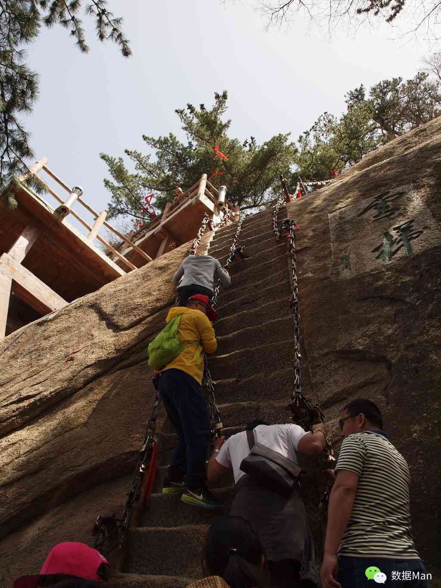

接下来是云梯，短短十来米的高度，不过却是极险的，可供放脚的地方十分狭小，几乎全靠手臂的力量把自己拽上去。景区倒是照顾游人，在旁边搭建了一座铁梯，如果你攀不上的话，可以从旁边的铁梯走。算了，这铁梯还是留给女士吧……

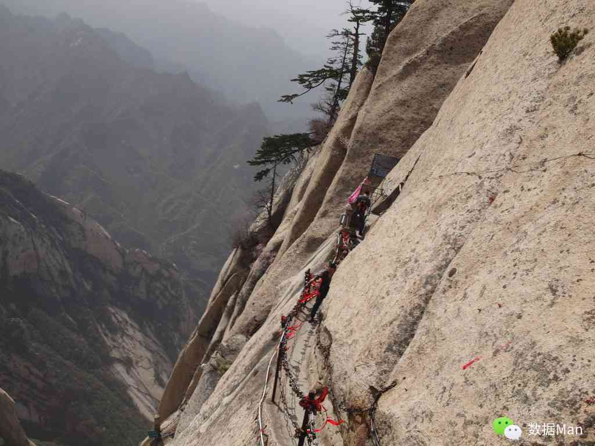

过了云梯即到杨公塔，也是东峰之顶。继续前行到南天门便通往华山最险处——长空栈道，此前还有一处也是危险，叫做“鹞子翻身”。我们怕时间不够，于是放弃了鹞子翻身，结果没想到到了长空栈道这儿，却被告知在检修，真是遗憾, 只得网上搜罗一张。不一会儿，即到了南峰之顶，这是华山的最高峰，即为华山之巅。

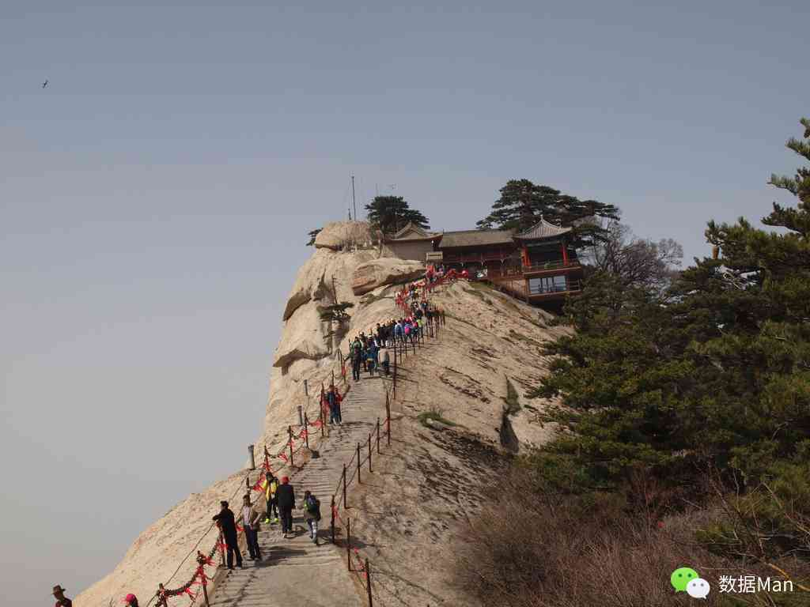

随后的西峰之路相对来说就很平稳了，在南峰经受高处寒风的洗礼，此间行走，感受夕阳，恨不得将这阳光揽在身上。不多一会儿，便到达了西峰。在昭示胜利的同时，也意味着此次的华山之旅的即将终结。

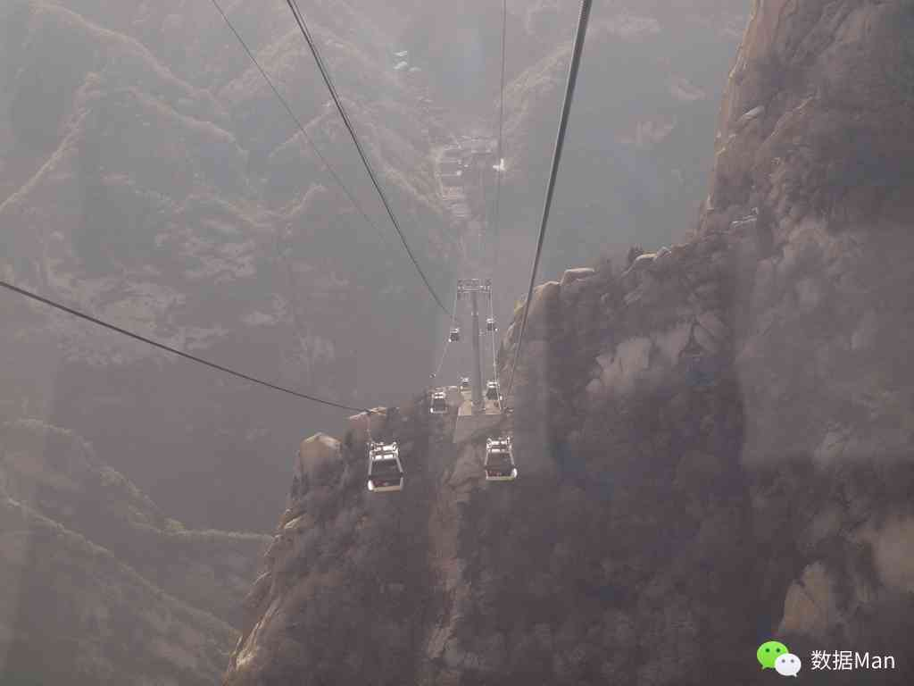

坐上缆车，才发现就我们两个人，旅途中的人在转身间看到的是陪你走过一程的伙伴，那份孤独也随之融化，代替的是那些个欢快的镜头与记忆。不经意间望向窗外，华山的山脊如此之苍凉，没有衡山那般的草木茂盛，但却给这离别之人浓郁的心境营造了一片开阔之地，顿时心情畅然了好多。缆车之后，再转一趟大巴，方得下山。至此，整个华山之旅便真的宣告结束了。

