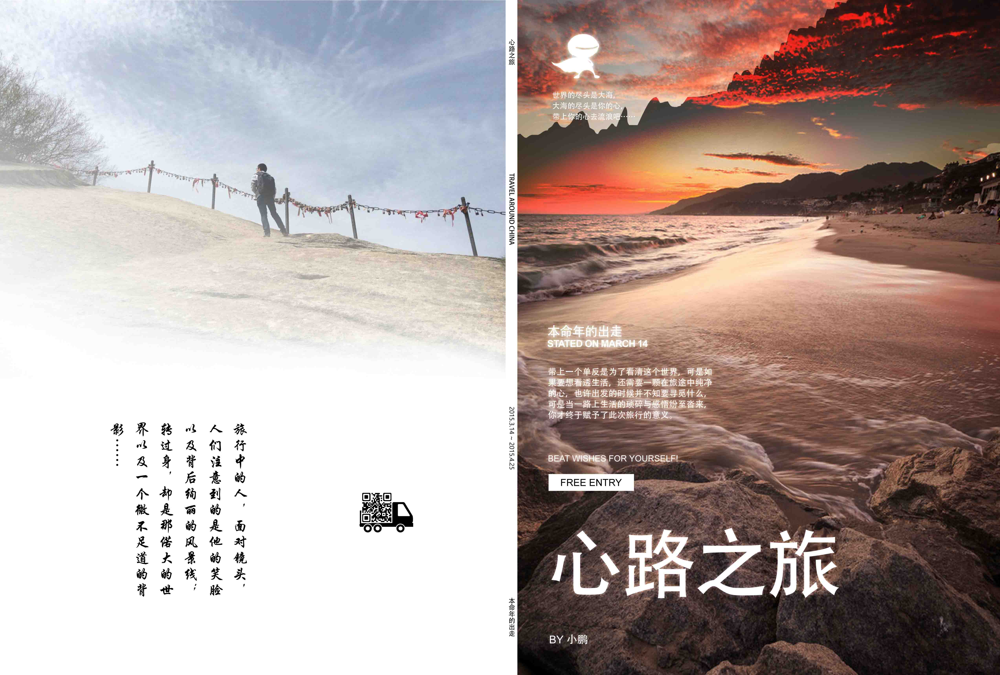

# 心路之旅（再版序）

最近闲来无事，于是想着把之前的东西整理下，便想到了四年前写的旅行小册。时间虽已过去挺远，但是当时的那段旅行对人生方向的摸索起到了很大的作用，因此值得回头审视一番。

为此值得写一篇文章，算是再版的序吧。之前的输出是纸质书籍，并不适合于电子设备的阅读，这时候想到了 [gitbook](https://github.com/gitbookio/gitbook)。利用 gitbook 几个简单的命令和 Github 就可以快速搭建一本在线电子书了，于是花了 3 天的时间将之前的文章、图片重新进行整理排版。

在整理的过程中，回头研读之前的文字，有点不忍心，文字很拙劣。不少地方有些矫情甚至做作，看得我一阵脸红。可是文字摆在面前，又怎能不是当时真实的我呢？这便是文字的力量，让我得以与过去对话，去理解当时的心境。

回首来到人世间的这二十多年，我跟蒋方舟一样也不曾历经沧桑，幸运的是在大学时的阅读与记录之间找到了思考的方向，为人生之路照亮了脚下。工作之后，忙碌的自己只顾着前方没有低头看路，而渐渐迷失了自己，辞职旅行的日子里让我找到了一面镜子。

说来也可笑，走了那么远的路，不是为了看远方，原是为了看自己。试想如果没有这段心路之旅，那么人生会有改变吗？想来还是没有，那意义何在？需要意义吗？也许不需要也可以！可是如果有意义，自认为找到了，那么便更能坚定当前的方向。这种绕路的结果，这样兜兜转转，无非就是更加坚信当前的路没有走错，那么继续走下去吧。

回到当时的自己，说说辞职旅行这件事情。对于我来说，最初的念头来自于喜马拉雅一个主题为“理想请晚点实现”的节目。而最终下定决心还是在纠结了几个月之后，可见并非一时兴起。当时老是有句话在脑海中——“父母在，不远游”，到很久之后才知道后面还有一句“游必有方”。

我只是想到父母健康，我还年轻，于是最终下定决心。走的路线也是精心挑选的，尽量选择有同学在的城市，就这样一路上在熟悉与陌生之间穿插，在相聚与孤独之间徘徊，在理想与现实之间挣扎。慢慢地，一路走来，从开始的疑惑，到确认，再到怀疑，最终坚信。其实就是一个自己与这个世界和解的过程，最终发现想要的无非也就是一般平淡的生活。也渐渐明白了那句“我们一路奋战，不是为了改变世界，而是为了不让世界改变我们”背后所蕴藏的巨大力量。

终于，行程一万公里，我在中国绕了个不大不小的圈，回到了最初出发的地方——上海。果然，“行万里路，才能回到内心深处”。

我不曾历经沧桑，但浪过，不遗憾！

—— 写于2019年7月15日